In 2022 Microsoft [announced](https://learn.microsoft.com/en-gb/microsoft-365-apps/security/internet-macros-blocked) auto-blocking of macros in Office documents downloaded from the Internet, a popular initial access method for threat actors. This forced threat actors to turn to other less common methods of malware delivery. One of the methods that [quickly](https://unit42.paloaltonetworks.com/brute-ratel-c4-tool/) [gained](https://thedfirreport.com/2022/04/25/quantum-ransomware/) [traction](https://thedfirreport.com/2023/04/03/malicious-iso-file-leads-to-domain-wide-ransomware/) was distribution through ISO-mounted files.

User double-clicks the ISO file, mounting it as a CD-ROM drive. The mounted drive contains a lure commonly in form of a LNK file masquerading as a document. When the victim executes the LNK lure it executes (often while utilizing additional tricks such as DLL-sideloading) a payload that is also placed on the mounted ISO drive. The payload and any other files except the lure file have hidden attribute set to avoid raising suspicion.

## Windows Telemetry

Let's now take a look at the possible ways how to detect this activity. Later, we'll look at how similar mechanisms could be used by an EDR agent when implementing a telemetry event monitoring for such activity.

### Audit Policy

One of the methods you might come across on the Internet is to use Windows audit policy subcategory `Removable Storage`. Auditing of removable storage is not enabled by default, you can enable it locally using the following command:

```
auditpol /set /subcategory:"Removable Storage" /success:enable /failure:disable
```

In production this could be configured via GPO. The event is available under Security event log with Event ID 4663. Apart from not being enabled by default, there are other drawbacks to this method. The log is not very robust. All it tells us is that an object, named something like, `\Device\CdRom1\` was accessed by process `explorer.exe`. This happens due to the fact that, explorer opens the location when user double-clicks the ISO file.

The auditing mechanism doesn't distinguish between physical and virtual removable storage. It can't provide you a link to the original file on disk. While this may be good enough, after all CD-ROMs are not that common on workstations anymore, we can do better.

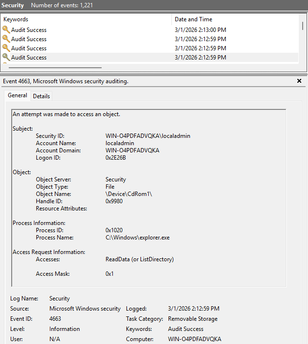

### Using ETW

Since we're mainly interested in virtual disks, and not removable storage in general, using `Microsoft-Windows-VHDMP {4D20DF22-E177-4514-A369-F1759FEEDEB3}` ETW provider is a better option. It doesn't require any configuration changes. This ETW provider is also exposed as `Microsoft-Windows-VHDMP-Operational` channel in event log. It contains events generated by `vhdmp.sys` (Virtual Hard Disk Miniport Driver), a driver responsible for parsing of various virtual images.

Mounting a drive generates multiple events. For detection engineering purposes the most interesting are:

| Event ID | Task Category | Description |
| ----------- | ----------- | ----------- |
| 1 | Surface Virtual Disk  | VHD has come online => Mount |
| 2 | Unsurface Virtual Disk | VHD has been removed => Unmount |
| 12 | Virtual Disk Handle Create | Handle for virtual disk created successfully |

While the Event IDs 1 and 2 contain very important information, path to the VHD file in `VhdFileName`, Event ID 12 contains also additional useful information such as `VhdType`.

```xml
<Event xmlns="http://schemas.microsoft.com/win/2004/08/events/event">
    <System>
        <Provider Name="Microsoft-Windows-VHDMP" Guid="e2816346-87f4-4f85-95c3-0c79409aa89d}" />
        <EventID>12</EventID>
        <Version>0</Version>
        <Level>4</Level>
        <Task>1201</Task>
        <Opcode>2</Opcode>
        <Keywords>0x8000000000000001</Keywords>
        <TimeCreated SystemTime="2026-02-28T12:23:01.3483226Z" />
        <EventRecordID>11</EventRecordID>
        <Correlation />
        <Execution ProcessID="6532" ThreadID="5384" />
        <Channel>Microsoft-Windows-VHDMP-Operational</Channel>
        <Computer>WIN-O4PDFADVQKA</Computer>
        <Security UserID="S-1-5-21-1531138472-40459374-3433676976-1000" />
    </System>
    <EventData>
        <Data Name="Status">0</Data> 
        <Data Name="VhdFile">\\?\C:\Users\localadmin\Desktop\test.iso</Data> 
        <Data Name="VmId">{00000000-0000-0000-0000-000000000000}</Data> 
        <Data Name="VhdType">3</Data> 
        <Data Name="Version">1</Data> 
        <Data Name="Flags">0</Data> 
        <Data Name="AccessMask">851968</Data> 
        <Data Name="WriteDepth">0</Data> 
        <Data Name="GetInfoOnly">false</Data> 
        <Data Name="ReadOnly">false</Data> 
        <Data Name="HandleContext">0x0</Data> 
        <Data Name="VirtualDisk">0x0</Data> 
        <Data Name="FileObject">0x0</Data> 
    </EventData>
</Event>
```

 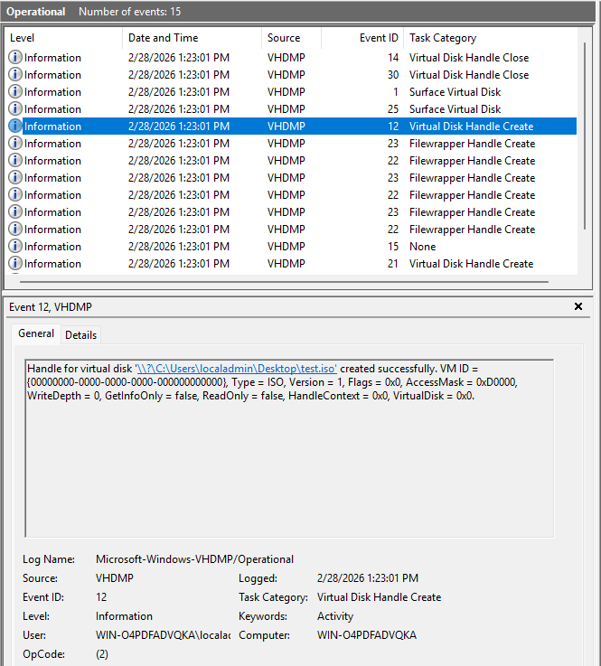

The `VhdType=0x3` is presented as string in the Event Viewer as `Type = ISO`, this means we can find some useful information in the ETW [manifest](https://github.com/zodiacon/EtwExplorer). There the `<valueMap>` for the `VirtualDiskType` field shows us what values we can expect in the data:

```xml
<valueMap name="VirtualDiskType">
    <map value="0x0" message="$(string.map_VirtualDiskTypeUndefined)" />
    <map value="0x1" message="$(string.map_VirtualDiskTypeVHD)" />
    <map value="0x2" message="$(string.map_VirtualDiskTypeVHDX)" />
    <map value="0x3" message="$(string.map_VirtualDiskTypeISO)" />
    <map value="0x4" message="$(string.map_VirtualDiskTypeVHDSET)" />
</valueMap>
```
Another reason why Event ID 12 is more suitable, compared to Event IDs 1 and 2, is that it contains `Execution ProcessID` pointing to `DllHost.exe /Processid:{51A1467F-96A2-4B1C-9632-4B4D950FE216}`. This is CLSID for `Shell Disc Image Mount`. This process is executed under the context of the user that mounted the image, allowing us to link the activity to specific user. The record in Event log is even enriched with the correct user SID.

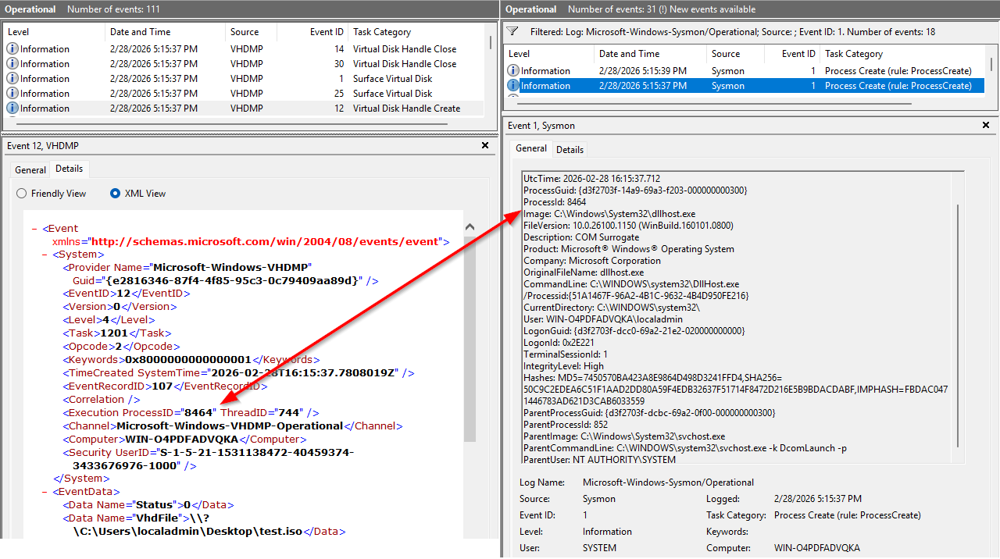

In Event IDs 1 and 2 `Execution ProcessID` shows value 4 which is `System` and therefore have the enriched SID set to `S-1-5-18` (nt authority/system).

There's one drawback to using Event ID 12. It is generated during both mount and unmount operations, seemingly with no obvious way how to distinguish them. However, if you look closely, you can notice that the value of `AccessMask` changes between the two operations. Mount operation has value `0xD0000` and unmount `0x40000`. We can't just check the manifest this time to see how to interpret these values and I couldn't find it documented anywhere in public documentation. Luckily, in 2016 researcher from Google's Project Zero found a vulnerability in `vhdmp.sys` ([CVE-2016-7225](https://project-zero.issues.chromium.org/issues/42452442)) and their PoC contains several of the enums used by this event.

```c
enum VirtualDiskAccessMask
{
    None = 0,
    AttachRo = 0x00010000,
    AttachRw = 0x00020000,
    Detach = 0x00040000,
    GetInfo = 0x00080000,
    Create = 0x00100000,
    MetaOps = 0x00200000,
    Read = 0x000d0000,
    All = 0x003f0000
}
```
Now we can see, that mount event value `0xD0000` consists of `AttachRo|Detach|GetInfo` while unmount value `0x40000` contains only `Detach`. Now we have enough information to build detection mechanism around this event.

Before we move on, it's worth mentioning an another ETW that can be also used. `Microsoft-Windows-VIRTDISK {4D20DF22-E177-4514-A369-F1759FEEDEB3}` provider exposes events generated by `VirtDisk.dll` a library used for VHD management APIs.

Here's a handy diagram from Microsoft [documentation](https://learn.microsoft.com/en-us/previous-versions/windows/desktop/legacy/dd323654(v=vs.85)) showing relationship of VHD features.

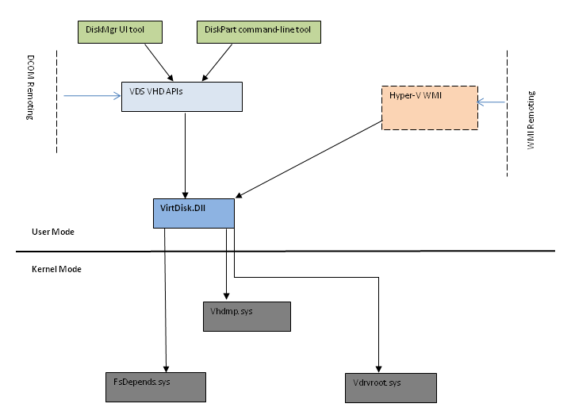

It has events with equivalent informational value as VHDMP Event IDs 1 and 2, but none of the events is as nice as Event ID 12.

| Event ID | Task Category | Description |
| ----------- | ----------- | ----------- |
| 1 | Open virtual disk. | Contains path to VHD under `VhdFileName` |
| 2 | Open virtual disk. | Contains pointer to VHD handle.|
| 3 | Attach virtual disk.| Contains pointer to VHD handle. |
| 4 | Attach virtual disk.| Result of the operation. |
| 5 | Detach virtual disk.| Contains pointer to VHD handle. |
| 6 | Detach virtual disk.| Result of the operation. |

Since this is in user-land it also originates from the `dllhost.exe` process. You can run the following trace with both providers to see how the request to mount the image is passed from user-land to kernel and back.

```c
logman create trace iso-tracing -ets
logman update iso-tracing -p Microsoft-Windows-VHDMP -ets
logman update iso-tracing -p Microsoft-Windows-VIRTDISK -ets
// Mount or Unmount an ISO image, stop the trace
logman stop iso-tracing -ets
```

## Detection: Velociraptor

Velociraptor is a handy DFIR tool, that among many other things allow us to subscribe to ETW providers and define detection logic in the form of an artifact. Similarly how an EDR agent would implement this event.

Following Client Monitoring artifact generates and event each time ISO image is mounted. You may wish to remove the `ISOType = "3"` condition to monitor for all types of disc images being mounted, VHD and VHDX can be abused as well.

```yaml
name: Windows.ETW.ISOMount
description: |
  This artifact monitors the endpoints for mounting of ISO files.

  This artifact uses the EWT provider:
  Microsoft-Windows-VHDMP           {E2816346-87F4-4F85-95C3-0C79409AA89D}

type: CLIENT_EVENT

sources:
  - query: |
      LET m <= memoize(key="Pid", period=30, query={
          SELECT Pid, Exe, Username FROM pslist()
      })

      LET hits = SELECT
         System.ID AS EventId,
         System.TimeStamp AS Timestamp,
         get(item=m, field=System.ProcessID) AS ProcInfo,
         get(member="EventData.VhdFile") AS ISOPath,
         get(member="EventData.VhdType") AS ISOType,
         get(member="EventData.AccessMask") AS AccessMask
      FROM watch_etw(
        description="Microsoft-Windows-VHDMP",
        guid="{E2816346-87F4-4F85-95C3-0C79409AA89D}")
      WHERE EventId = 12 AND ISOType = "3" AND AccessMask = "0xD0000"
      
      SELECT EventId, Timestamp, ISOPath, ProcInfo FROM hits
```
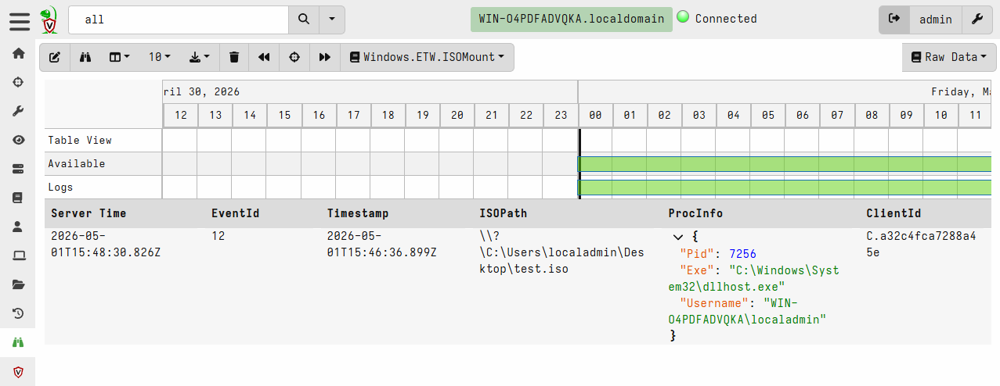

## Detection: EDR

Some EDRs expose this exact ETW event through their telemetry, while others may use driver-based approach. You can find a list of EDRs that support this event on the [edr-telemetry.com](https://www.edr-telemetry.com/windows) project page, under the "Virtual Disk Mount" sub-category. If EDR supports it, then it'll most likely also have behavioral indicators or detection rules utilizing it.

Here, is an example showing indicators related to mounting of ISO file in ESET Protect. The endpoint has ESET Inspect EDR module installed.

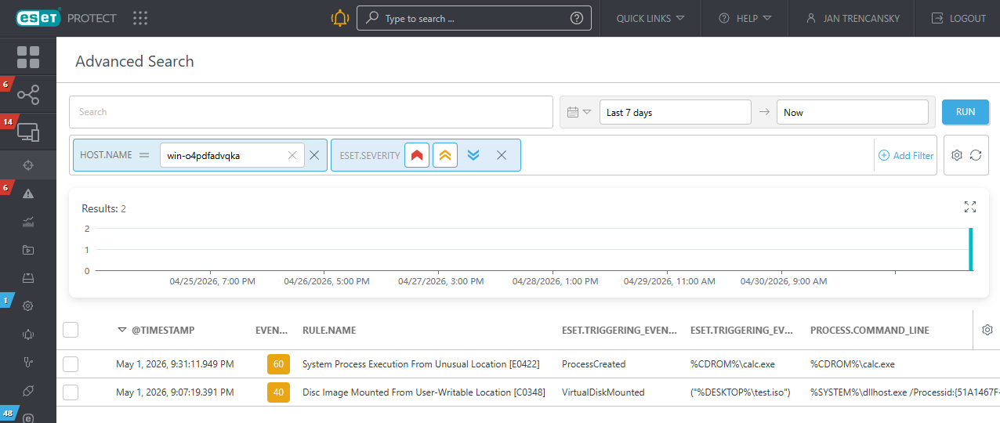

## Prevention: Configuration

### Change Default Action

One of the mitigation strategies is to change the default behavior from "Mount" to "Burn to disc", when user double-clicks the ISO file. This can be achieved by creating `ProgrammaticAccessOnly` key under `HKEY_CLASSES_ROOT\Windows.IsoFile\shell\mount`

You can run the following command as administrator:

```
reg add HKEY_CLASSES_ROOT\Windows.IsoFile\shell\mount /v ProgrammaticAccessOnly /t REG_SZ
```

Now, the default action as well as the right-click context menu will default to "Burn to disc". The same can also be achieved for VHD and VHDX, you just need to create the key under `HKEY_CLASSES_ROOT\Windows.VhdFile\shell\mount`. This change doesn't require reboot.

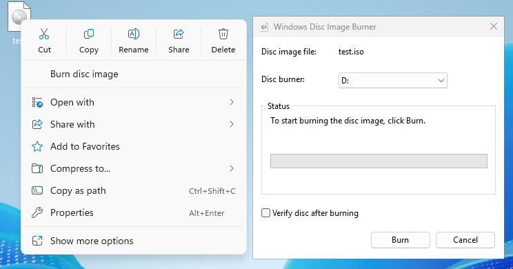

### Prevent Virtual DVD-ROM Installation Using GPO

Mounting of ISO images can also be achieved by restricting the device installation of Virtual DVD-ROM using GPO.

Computer Configuration -> Administrative Templates -> System -> Device Installation -> Device Restrictions

There you can enable "Prevent installation of devices that match any of these device IDs" and block device `SCSI\CdRomMsft____Virtual_DVD-ROM_`. Don't forget to check "Also apply to matching devices that are already installed."

You should also enable "Allow administrators to override Device Installation Restriction policies". This allows users with administrator privileges to mount ISO images. Hopefully your users don't have local administrator rights, otherwise you should concentrate on fixing that.

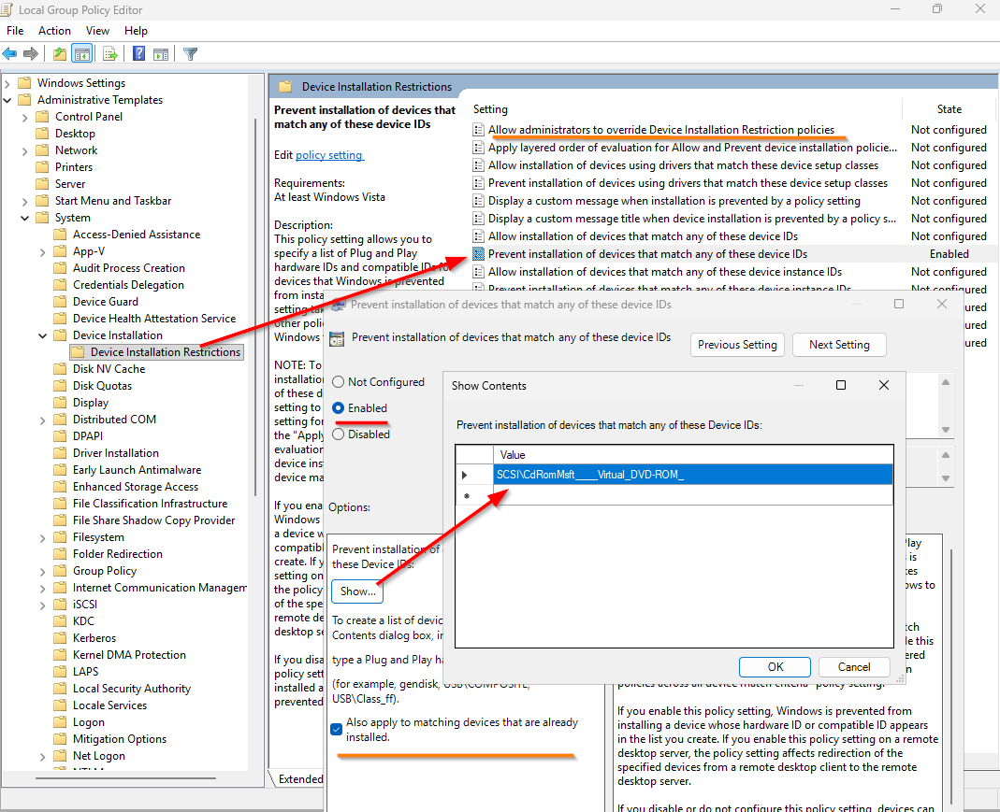

This policy should be applied to workstations only, as the TTP targets users for initial access. Blocking virtual drives on servers has little benefit and could cause problems for your sysadmins, such as being unable to mount ISO with updates from hypervisor.

## Prevention: Device Control

Most EDRs, which support device control, will allow you to block DVD-ROMs. While they may not support blocking only virtual devices, physical drives are rare nowadays, so it shouldn't really be a problem.

Here I'll briefly show steps on how to configure policy for ESET Endpoint Security through ESET Protect platform. In ESET Protect navigate to:

Configuration -> Advanced Setup -> New Policy

Name the policy, then select "Settings" and select product for the policy, most likely "ESET Endpoint for Windows" (I'm using "ESET Server Security"). Go to "Protections" -> "Device Control". You must enable the device control, as it's not enabled by default. Enabling device control requires restart to take effect.

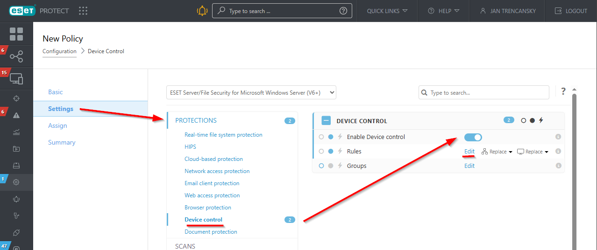

Under "Rules" click edit and create an enabled blocking rule for CD/DVD device type. Save the rule, continue to assignment and assign the policy to desired endpoints.

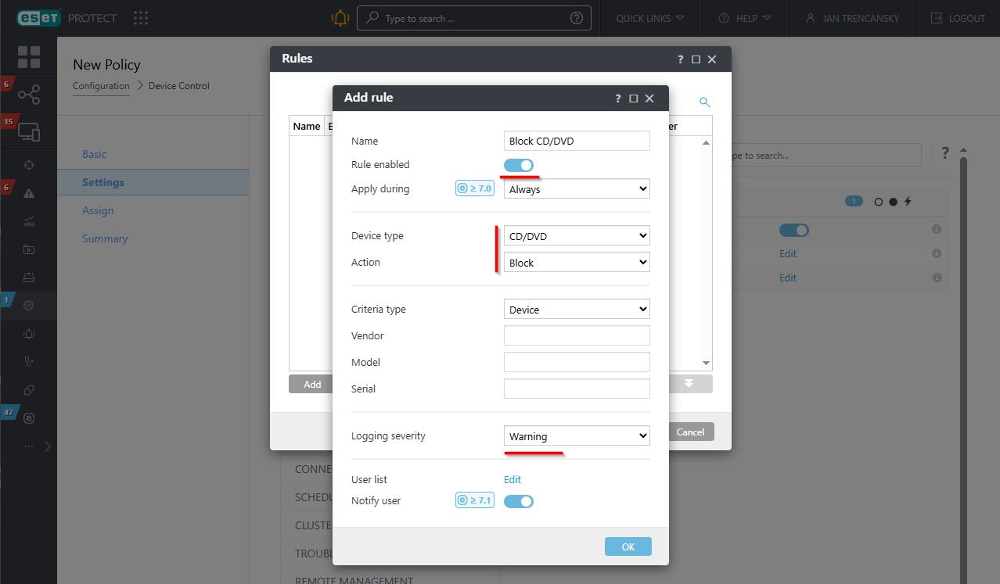

After restart, the ISO won't mount.

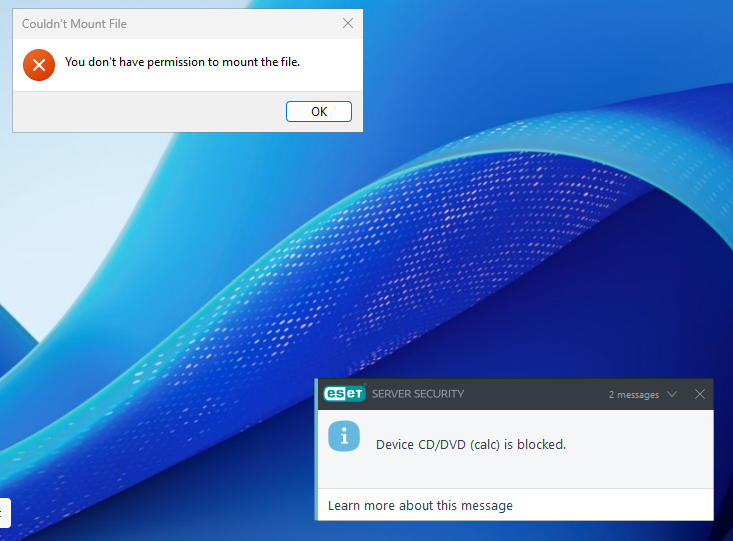
